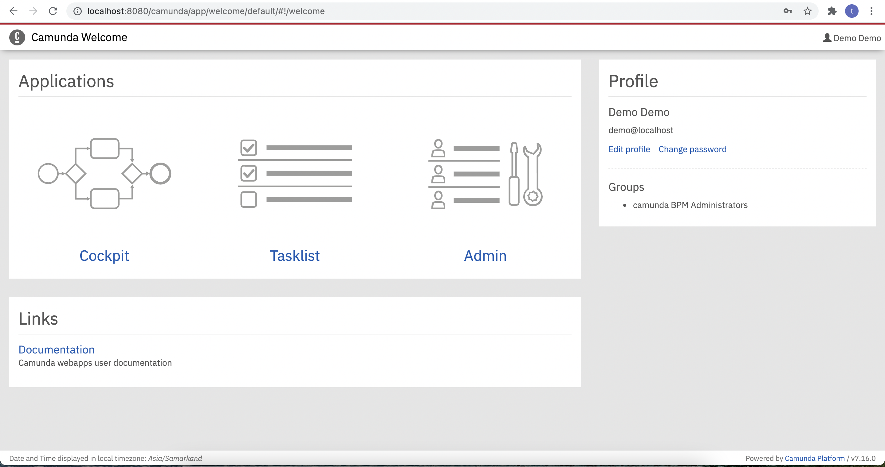
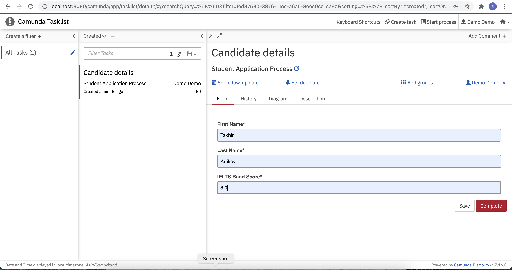
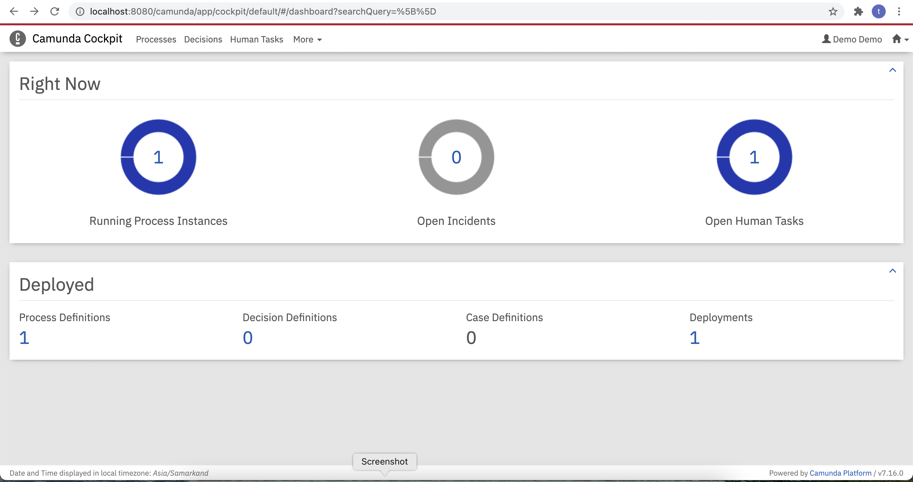
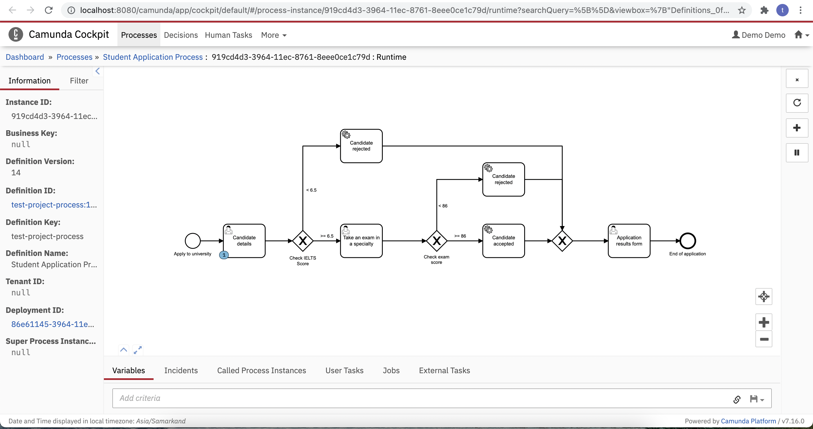
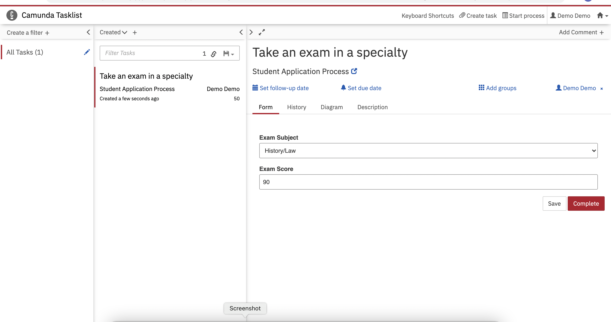
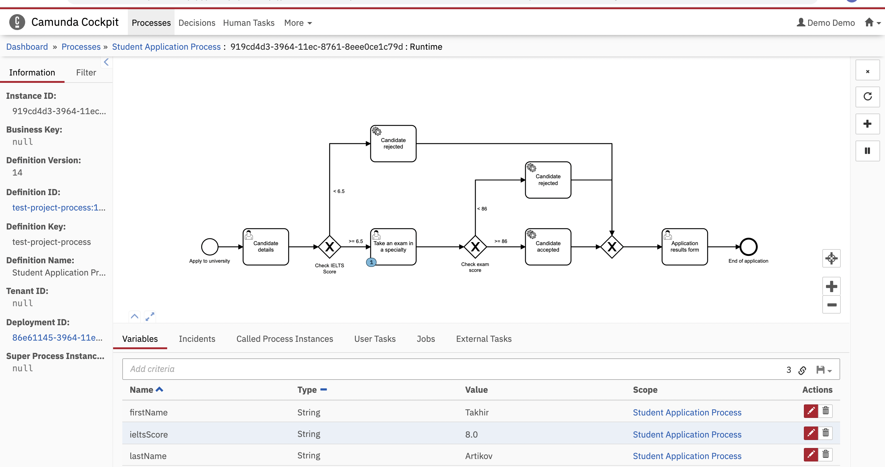
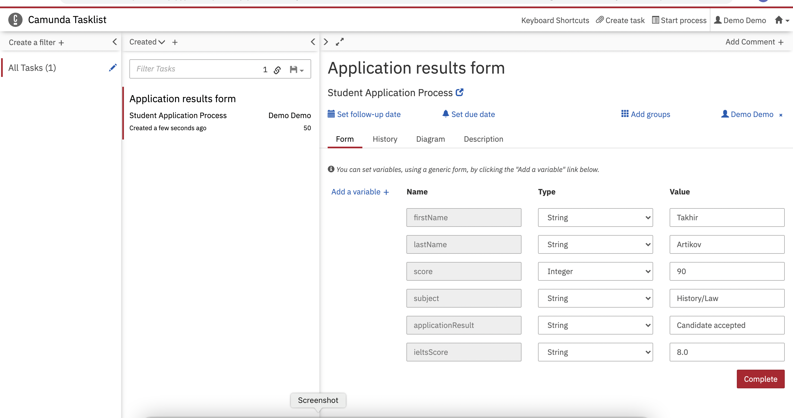
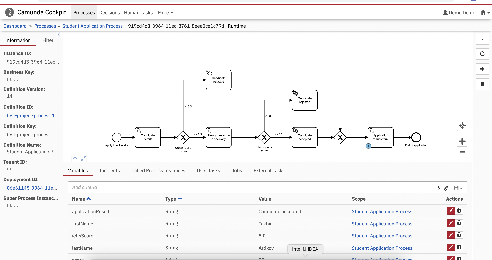

# Spring Boot Project with Camunda

This project is created to learn what Camunda Platform is  and how it works.

## What is this all about?

In this example, I build university application process which consists of three parts.

- Candidate details and checking IELTS score
- Taking an exam in a specialty
- Application result

## What we will need

 - Java JDK 11 so that you can run the Camunda Platform
 - Camunda Modeler for building and deploying BPMN Models
 - An integrated development environment for Java like IntelliJ IDEA

# Process stages

Run application and enter url http://localhost:8080/camunda/app/welcome/default/#!/welcome in browser and we are in Camunda welcome page.

 - Cockpit gives you a real-time view of BPMN processes and DMN decision tables as they run, so you can monitor their status and quickly identify technical incidents that slow down or stop workflows.
 - Tasklist is an out-of-the-box web application that’s tightly integrated with Camunda’s process orchestration capabilities. Simply model a business process using the BPMN standard and deploy it to the Workflow Engine; when a user needs to work on a task, they’ll see it appear in Tasklist.
 - Admin is an application that allows you to configure users and groups via the engine’s Identity Service and authorizations via the engine’s Authorization Service.

In Tasklist, we start process by clicking "Start process" and we arrive the first stage of the process.

In Cocklist, we can see the process step

Process stage 2. Exam

Process stage 3. Application result

